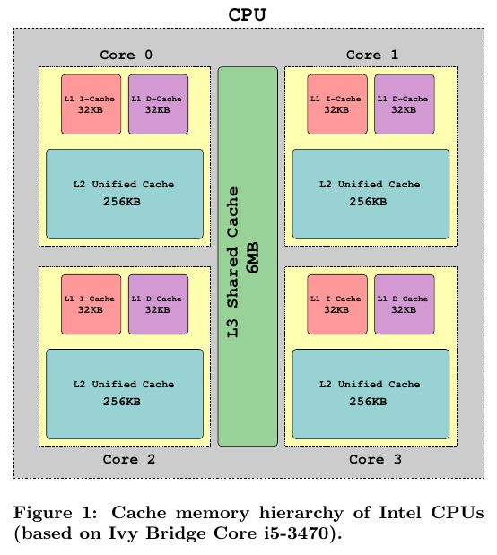

#Side-channel attacks and their implications
Maël Nogues

##Introduction
Side-channel attacks have been known and used by the intelligence community as early as in WWII and were first discussed in an academic context in 1996 by Kocher.
They allow attackers to extract information hidden in a device by analyzing the physical signals it emits as it performs its secure computations.

Side-channel analysis has been shown to be very effective in a lot of different systems from the real-world, like car immobilizers or high-security cryptographic coprocessors.

A particular kind of side-channel attacks, that can be used on personal computers, are cache attacks. It exploits the use of cache memory as a shared ressource between different processes to disclose information.
They

##Background and state of the art
###Memory hierarchy of Intel CPUs
Modern computers systems use high-speed CPUs with a large amount of lower-speed RAM. As the performance gap between these two components is huge, they make use of *cache memory*, a smaller but faster type of memory than RAM.
Cache memory contains a subset of the RAM's contents, that was recently accessed by the CPU, and is typically arranged in a *cache hierarchy* : series of progressively larger and slower memory elements, placed in various levels between the CPU and RAM.

Figure 1 shows the cache hierarchy of Intel Haswell CPUs, incorporating a small and fast level 1 (L1) cache, a slightly larger
level 2 (L2) cache, and finally, a larger level 3 (L3) cache, which in turn is connected to the RAM.
Whenever the CPU wishes to access physical memory, the respective address is first searched for in the cache hierarchy, saving the lengthy round-trip to the RAM.

If the CPU needs something that is not currently in the cache, an event known as a *cache miss*, one of the elements currently residing in the cache is evicted to make room for this new element. The decision of which element to evict in the event of a cache miss is made by a heuristic algorithm, which has changed between processor generations.

Intel’s cache micro-architecture is *inclusive*: all elements in the L1 cache exist in the L2 and L3 caches. Inversely, if an element is evicted from the L3 cache, it is also immediately evicted from the L2 and L1 cache.
It should be noted that the AMD cache micro-architecture is *exclusive*, and thus, the attacks developped for the Intel architecture are not directly applicable to that platform and vice-versa.

###Cache attacks
The cache attacks is a well-known attack of the micro-architectural side-channel attacks class. They are defined by Aciiçmez as attacks that "exploit deeper processor ingredients below the trust architecture boundary" to recover secrets from various secure systems. Cache attacks make use of the fact that—regardless of higher-level security mechanisms, like protection rings, virtual memory, hypervisors, and sandboxing—secure and insecure processes can interact through their shared use of the cache.
